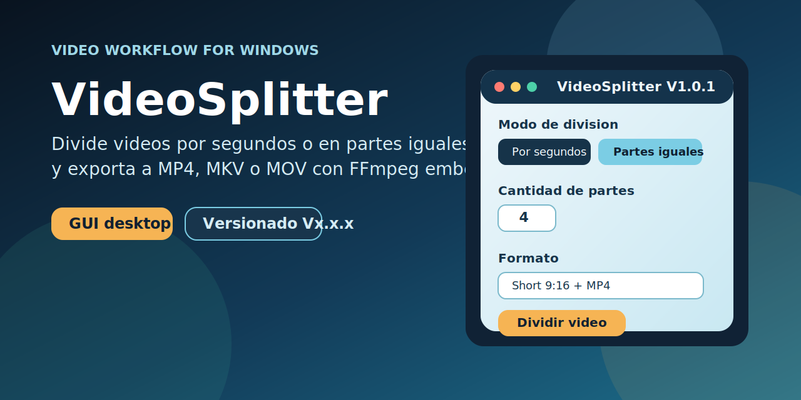
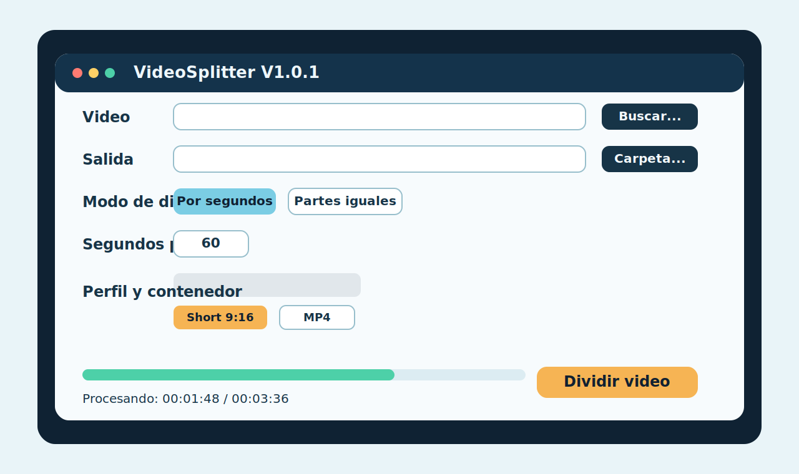
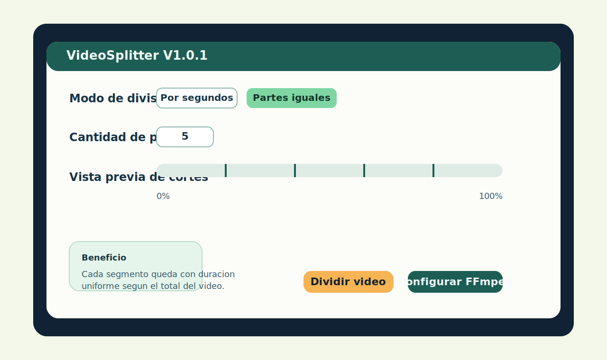

# VideoSplitter V1.5.1

[](https://github.com/erickson558/videosplitter/actions/workflows/ci.yml)
[](https://github.com/erickson558/videosplitter/releases)
[](https://github.com/erickson558/videosplitter/blob/main/LICENSE)
[](https://www.python.org/downloads/)
[](https://github.com/erickson558/videosplitter/releases)

> Aplicacion de escritorio Windows para dividir videos en segmentos numerados con aceleracion por GPU o CPU, formatos MP4/MKV/MOV y perfiles de salida para Shorts y video horizontal.



---

## Tabla de contenidos

- [Caracteristicas](#caracteristicas)
- [Vista del producto](#vista-del-producto)
- [Descarga rapida](#descarga-rapida)
- [Requisitos](#requisitos)
- [Instalacion para desarrollo](#instalacion-para-desarrollo)
- [Uso](#uso)
- [Configuracion de GPU](#configuracion-de-gpu)
- [Configuracion persistente](#configuracion-persistente)
- [Compilar el ejecutable](#compilar-el-ejecutable)
- [Tests](#tests)
- [Versionado](#versionado)
- [Release automatizada](#release-automatizada)
- [Estructura del proyecto](#estructura-del-proyecto)
- [Contribuir](#contribuir)
- [Licencia](#licencia)

---

## Caracteristicas

| Funcionalidad | Detalle |
|---|---|
| Division por segundos | Parte el video en segmentos de N segundos |
| Division en partes iguales | Divide el video en N partes de igual duracion |
| Aceleracion por hardware | Detecta y usa GPU NVIDIA (NVENC), Intel (QSV) o AMD (AMF) automaticamente |
| Fallback automatico | Si la GPU falla en tiempo de ejecucion, reintenta con CPU sin interrumpir al usuario |
| Seleccion por GPU instalada | Detecta adaptadores NVIDIA/Intel/AMD instalados y muestra opciones compatibles en la GUI |
| Modo todas las GPU NVIDIA | Permite usar `-gpu any` para que FFmpeg use cualquier GPU NVIDIA disponible |
| Modo multiproceso NVIDIA+AMD | Reparte segmentos entre NVENC y AMF en paralelo para aprovechar dos GPUs en el mismo trabajo |
| Multiidioma GUI | Selector de idioma con soporte Espanol/English y persistencia automatica |
| Barra de menus + atajos | Incluye menu Archivo/Ayuda con aceleradores (Ctrl+O, Ctrl+L, F5, Esc, Ctrl+Q, F1) |
| Boton Salir | Cierre directo de app desde la interfaz y menu |
| Flujo no intrusivo | Reemplaza messagebox por estados en barra de progreso y dialogo About no bloqueante |
| Selector de GPU | ComboBox para elegir dispositivo: auto, CPU, GPU especifica por indice, QSV o AMF |
| Arrastrar y soltar | Permite cargar video arrastrando el archivo a la zona de drop de la ventana |
| Cancelacion segura | Boton para cancelar la conversion liberando el proceso FFmpeg activo |
| Progreso dual | Muestra porcentaje procesado y porcentaje pendiente durante la conversion |
| Perfiles de video | Short 9:16 (1080x1920), Normal 16:9 (1920x1080) u Original (sin redimensionar) |
| Contenedores | MP4, MKV y MOV |
| Codec de video | H.264 (libx264 / h264_nvenc / h264_qsv / h264_amf) |
| Codec de audio | AAC 128 kbps, 48 kHz |
| Configuracion persistente | Guarda todas las preferencias en `videosplitter.settings.json` |
| Sin instalacion | `.exe` portable con FFmpeg embebido, listo para usar |

---

## Vista del producto

### Pantalla principal



### Modo partes iguales



---

## Descarga rapida

Descarga `VideoSplitter.exe` desde la [pagina de releases](https://github.com/erickson558/videosplitter/releases/latest).  
No requiere instalacion. FFmpeg esta embebido en el ejecutable.

---

## Requisitos

### Para usar el ejecutable

- Windows 10 / 11 (64-bit)
- No requiere Python ni FFmpeg instalados

### Para desarrollar o compilar

- Python 3.10 o superior (recomendado 3.12)
- Git
- GitHub CLI (`gh`) para automatizar releases

---

## Instalacion para desarrollo

```powershell
# 1. Clonar el repositorio
git clone https://github.com/erickson558/videosplitter.git
cd videosplitter

# 2. Crear entorno virtual
python -m venv .venv
.\.venv\Scripts\Activate.ps1

# 3. Instalar dependencias de build
pip install -r requirements-build.txt
```

No hay dependencias de runtime (la app usa solo la libreria estandar de Python + Tkinter).

---

## Uso

### Ejecutar en desarrollo

```powershell
python main.py
```

### Pasos en la interfaz

1. **Video** — selecciona el archivo de entrada con `Buscar...` o arrastrando y soltando
2. **Salida** — elige la carpeta donde se guardan las partes
3. **Modo de division** — `Por segundos` o `Partes iguales`
4. **Perfil de video** — Short 9:16, Normal 16:9 u Original
5. **Contenedor** — MP4, MKV o MOV
6. **Procesamiento** — elige dispositivo GPU o CPU (ver abajo)
7. Pulsa **Dividir Video**
8. Si necesitas detener el proceso, pulsa **Cancelar** para liberar FFmpeg

### Ejemplo de salida

Para un archivo `MiVideo.mp4` dividido en 3 partes:

```
MiVideo Parte 1.mp4
MiVideo Parte 2.mp4
MiVideo Parte 3.mp4
```

---

## Configuracion de GPU

El ComboBox **Procesamiento** se llena automaticamente al iniciar la app segun los encoders que reporte FFmpeg y las GPUs detectadas por `nvidia-smi`:

| Opcion | Descripcion |
|---|---|
| `Automatico (GPU si existe, sino CPU)` | Selecciona el mejor encoder disponible al arrancar |
| `Solo CPU` | Fuerza `libx264` independientemente del hardware |
| `GPU NVIDIA (todas)` | Usa `h264_nvenc` sin fijar indice de GPU |
| `GPU NVIDIA 0: <nombre>` | Ancla la codificacion a la GPU 0 (`-gpu 0`) |
| `GPU NVIDIA 1: <nombre>` | Ancla la codificacion a la GPU 1 (`-gpu 1`) |
| `GPU Intel QSV` | Usa `h264_qsv` |
| `GPU AMD AMF` | Usa `h264_amf` |

Si el encoder GPU seleccionado falla durante el procesamiento, la app reintenta automaticamente con CPU sin necesidad de intervencion del usuario.

Las opciones mostradas dependen del hardware y de los encoders compilados en el FFmpeg embebido.

---

## Configuracion persistente

El archivo `videosplitter.settings.json` se crea automaticamente y guarda:

```json
{
  "app_version": "1.4.0",
  "language": "es",
  "input_video": "C:/Users/.../Videos/origen.mp4",
  "split_mode": "seconds",
  "segment_seconds": 60,
  "equal_parts_count": 2,
  "video_profile": "short_9_16",
  "container_format": "mp4",
  "processing_device": "auto",
  "output_dir": "C:/Users/.../Videos",
  "ffmpeg_path": "C:/ruta/a/ffmpeg.exe"
}
```

| Campo | Descripcion |
|---|---|
| `app_version` | Version de la app que genero este archivo |
| `language` | Idioma de la GUI (`es` o `en`) |
| `input_video` | Ultimo archivo de video seleccionado en la GUI |
| `split_mode` | `seconds` o `equal_parts` |
| `segment_seconds` | Segundos por segmento (modo `seconds`) |
| `equal_parts_count` | Numero de partes iguales |
| `video_profile` | `short_9_16`, `normal_16_9` o `original` |
| `container_format` | `mp4`, `mkv` o `mov` |
| `processing_device` | `auto`, `cpu`, `gpu_all`, `gpu_0`, `gpu_1`, `gpu_qsv`, `gpu_amf` |
| `output_dir` | Ultima carpeta de salida usada |
| `ffmpeg_path` | Ruta personalizada a ffmpeg.exe (opcional) |

---

## Compilar el ejecutable

```powershell
python build_exe.py
```

El script:

- Usa el primer `.ico` que encuentre en la raiz del proyecto.
- Descarga FFmpeg si no existe en `third_party/ffmpeg/`.
- Inserta la version actual de `app_metadata.py` en los metadatos del `.exe`.
- Genera `VideoSplitter.exe` en la carpeta raiz del proyecto.

---

## Tests

```powershell
# Suite completa (unit + integration)
python -m unittest discover -s tests -v

# Solo tests unitarios (rapidos, sin FFmpeg real)
python -m unittest test_models test_settings test_video_splitter_service test_release -v

# Solo test de integracion (requiere FFmpeg disponible)
python -m unittest tests.test_integration_split -v
```

Los tests cubren:

- Validacion de configuracion de jobs (`test_models.py`)
- Persistencia de settings y retrocompatibilidad (`test_settings.py`)
- Generacion de comandos FFmpeg, seleccion de encoder GPU y mapeo de indice (`test_video_splitter_service.py`)
- Construccion de release notes y clasificacion de commits (`test_release.py`)
- Split de extremo a extremo con video sintetico real + fallback CPU (`test_integration_split.py`)

---

## Versionado

El proyecto usa [Versionado Semantico](https://semver.org/) en formato `Vx.x.x` (`MAJOR.MINOR.PATCH`).

| Nivel | Cuando usarlo |
|---|---|
| `patch` | Correcciones de bugs, mejoras internas, documentacion, build |
| `minor` | Nuevas funcionalidades compatibles hacia atras |
| `major` | Cambios incompatibles o redisenos arquitecturales |

La version esta centralizada en `app_metadata.py` y se propaga automaticamente a:

- Titulo de la ventana
- Metadatos del `.exe` (FileVersion, ProductVersion)
- `videosplitter.settings.json`
- `README.md`
- `CHANGELOG.md`
- Tag de Git y Release de GitHub

---

## Release automatizada

```powershell
# Patch (por defecto) — correcciones y mejoras menores
python scripts/release.py "fix: descripcion del cambio"

# Minor — nueva funcionalidad
python scripts/release.py "feat: nueva funcionalidad" --level minor

# Major — cambio incompatible
python scripts/release.py "feat!: rediseno" --level major

# Sin recompilar el .exe (solo docs / scripts)
python scripts/release.py "docs: actualiza documentacion" --skip-build-exe
```

El script `scripts/release.py` hace automaticamente:

1. Incrementa la version en `app_metadata.py`, `README.md` y `videosplitter.settings.json`
2. Actualiza `CHANGELOG.md` con los commits clasificados por tipo
3. Recompila `VideoSplitter.exe` (a menos que se pase `--skip-build-exe`)
4. Crea el commit, el tag Git y hace push a `main`
5. Crea la Release en GitHub con notas y adjunta el `.exe`

---

## Estructura del proyecto

```
videosplitter/
├── main.py                      # Entrypoint de la aplicacion
├── app_metadata.py              # Version y nombre centralizados
├── build_exe.py                 # Script de compilacion Windows
├── videosplitter.settings.json  # Configuracion persistente del usuario
├── videosplitter.ico            # Icono de la aplicacion
├── requirements-build.txt       # Dependencias para compilar
├── CHANGELOG.md                 # Historial de versiones
├── LICENSE                      # Apache License 2.0
│
├── backend/
│   ├── models.py                # Modelos de datos (SplitJobConfig)
│   ├── video_splitter_service.py # Logica de negocio + deteccion GPU
│   ├── ffmpeg_locator.py        # Descubrimiento de binarios FFmpeg
│   ├── output_formats.py        # Perfiles de video y contenedores
│   ├── settings.py              # Lectura/escritura de settings
│   ├── runtime_paths.py         # Rutas en dev y en .exe
│   └── errors.py                # Excepciones del dominio
│
├── frontend/
│   └── main_window.py           # Interfaz Tkinter
│
├── scripts/
│   └── release.py               # Automatizacion de releases
│
├── tests/
│   ├── test_models.py
│   ├── test_settings.py
│   ├── test_video_splitter_service.py
│   ├── test_release.py
│   └── test_integration_split.py
│
├── third_party/
│   └── ffmpeg/                  # ffmpeg.exe y ffprobe.exe (no en git)
│
└── .github/
    ├── workflows/ci.yml         # CI: compilar + tests
    └── dependabot.yml           # Actualizaciones automaticas de dependencias
```

---

## Contribuir

1. Haz fork del repositorio.
2. Crea una rama descriptiva: `git checkout -b feat/mi-funcionalidad`
3. Escribe tests para los cambios nuevos.
4. Asegurate de que `python -m unittest discover -s tests -v` pase completo.
5. Abre un Pull Request con una descripcion clara del cambio.

Convenciones de commits (Conventional Commits):

```
feat:     nueva funcionalidad
fix:      correccion de bug
docs:     cambios en documentacion
test:     agregar o corregir tests
build:    cambios en build o dependencias
chore:    mantenimiento, refactor menor
```

Consulta [CONTRIBUTING.md](CONTRIBUTING.md) para mas detalles.

---

## Licencia

Distribuido bajo [Apache License 2.0](LICENSE).  
Copyright 2024-2026 erickson558.
